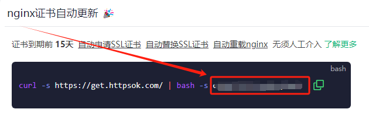

## nginx

在官方镜像[nginx:alpine](https://hub.docker.com/_/nginx)基础上适配httpsok。自动申请或续期SSL证书并部署。   
推荐本人[➦自用机场](https://xn--clouds-o43k.com/#/register?code=Eys6COZC) 便宜量大稳定10元1T每月。   

   


## 基本用法：

```bash
docker run -d \   
-v /宿主机nginx配置文件的实际路径:/etc/nginx \ #挂载nginx配置文件及证书(非必要，可进入容器后再配置，如挂载证书需在路径：/宿主机nginx配置文件的实际路径/key/，如果证书有效则跳过自动申请)
-e HTTPSOK=value \ #httpsok的TOKEN(非必要，可进入容器后再部署)
-e TZ=Asia/Shanghai \   
--restart=always \   
--network host \   
--name nginx \   
bin20088/nginx:latest   
 ```

如何查找httpsok的TOKEN：   
在[httpsok官网](https://httpsok.com/)注册登陆后，在首页概览里如下位置   

   

其他配置及用法详见官方镜像[nginx:alpine](https://hub.docker.com/_/nginx) 和 [httpsok官网](https://httpsok.com/)   

## 致谢

- [nginx](https://hub.docker.com/_/nginx)   
- [httpsok](https://httpsok.com/)   

## 免责  

如有侵权，请告知，即刻删除。   
本项目禁止任何商业及盈利使用，禁止任何违法犯罪使用。  
